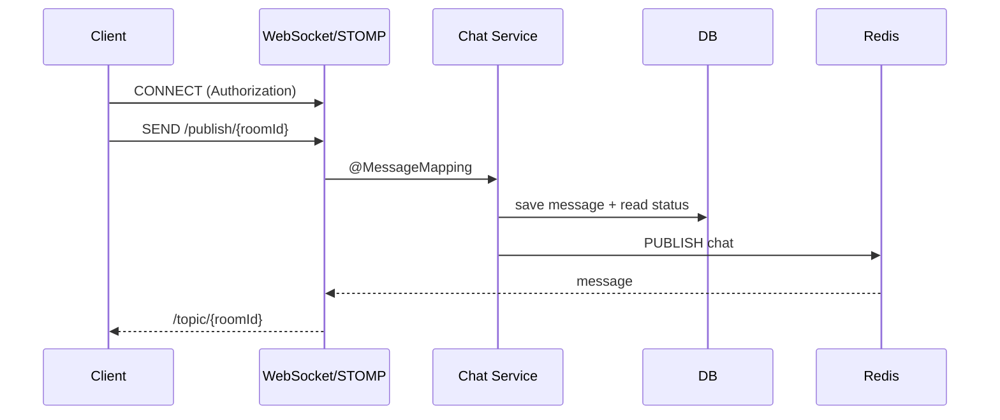

# Live Chatting Backend

WebSocket, STOMP, Redis Pub/Sub을 활용한 실시간 채팅 백엔드 프로젝트 입니다.

## Tech Stack

- `Spring Boot 3.5.8`
- `Java JDK 21`
- `Spring Web`, `Spring Security`, `Spring Data JPA`, `Spring Data Redis`
- `MySQL`, `Redis`
- `WebSocket` + `STOMP`
- `JWT` 인증

## 핵심 기능 요약

- 회원 가입/로그인(JWT 발급)
- 그룹 채팅방 생성/참여/퇴장
- 1:1 채팅방 생성 또는 기존 방 반환
- 채팅 메시지 저장 + 읽음 상태 관리
- STOMP 메시지 브로커 + Redis Pub/Sub로 실시간 전송

## 실행 환경

1) MySQL 준비  
- DB 생성: `chatdb`  
- 계정/비밀번호는 `src/main/resources/application.yml` 참고

2) Redis 준비  
- 기본 포트 `6379`

3) 실행
```bash
./gradlew bootRun
```

## 인증 흐름

- 로그인 성공 시 JWT 토큰 발급
- REST API는 `Authorization: Bearer {token}` 필요
- STOMP CONNECT 시에도 `Authorization` 헤더 필요

## WebSocket/STOMP 흐름

1) 클라이언트가 `/connect`로 연결(SockJS 지원)
2) 메시지 발행: `/publish/{roomId}`
3) 서버가 메시지 저장 후 Redis 채널 `"chat"`으로 publish
4) Redis 구독자가 수신하여 `/topic/{roomId}`로 브로드캐스트
5) 클라이언트는 `/topic/{roomId}`를 subscribe

## 메시지 흐름 다이어그램



## WebSocket/STOMP 명세

- Endpoint: `/connect` (SockJS 지원)
- Publish Prefix: `/publish`
- Subscribe Topic: `/topic/{roomId}`

Message Payload (`ChatMessageDto`)
```json
{
  "message": "안녕하세요",
  "senderEmail": "user@example.com"
}
```

## REST API 명세

### Member

- POST `/member/create`
  - Auth: No
  - Body
    ```json
    {"name":"홍길동","email":"user@example.com","password":"pass1234"}
    ```
  - Response: `memberId`

- POST `/member/doLogin`
  - Auth: No
  - Body
    ```json
    {"email":"user@example.com","password":"pass1234"}
    ```
  - Response
    ```json
    {"id":1,"token":"jwt-token"}
    ```

- GET `/member/list`
  - Auth: Yes
  - Response
    ```json
    [{"id":1,"name":"홍길동","email":"user@example.com"}]
    ```

### Chat

- POST `/chat/room/group/create?roomName=java`
  - Auth: Yes
  - Response: `200 OK`

- GET `/chat/room/group/list`
  - Auth: Yes
  - Response
    ```json
    [{"roomId":1,"roomName":"java"}]
    ```

- POST `/chat/room/group/{roomId}/join`
  - Auth: Yes
  - Response: `200 OK`

- DELETE `/chat/room/group/{roomId}/leave`
  - Auth: Yes
  - Response: `200 OK`

- POST `/chat/room/private/create?otherMemberId=2`
  - Auth: Yes
  - Response: `roomId`

- GET `/chat/history/{roomId}`
  - Auth: Yes
  - Response
    ```json
    [{"message":"안녕하세요","senderEmail":"user@example.com"}]
    ```

- POST `/chat/room/{roomId}/read`
  - Auth: Yes
  - Response: `200 OK`

- GET `/chat/my/rooms`
  - Auth: Yes
  - Response
    ```json
    [{"roomId":1,"roomName":"java","isGroupChat":"Y","unReadCount":3}]
    ```

## 복습 포인트

- WebSocket은 HTTP Upgrade 후 단일 TCP 연결을 유지하며 양방향 통신을 제공한다.
- STOMP는 `CONNECT/SEND/SUBSCRIBE` 프레임 기반 프로토콜로, 메시지 라우팅 규칙을 명확히 만든다.
- `setApplicationDestinationPrefixes("/publish")`는 서버 진입점, `/topic`은 브로커 구독 경로로 분리된다.
- `@MessageMapping`은 STOMP SEND를 수신하는 서버 핸들러이며, 구독 경로는 `SimpMessageSendingOperations`로 전파된다.
- Redis Pub/Sub은 영속 저장이 없고, 구독 중인 클라이언트에만 전달된다(오프라인 복구 불가).
- 멀티 인스턴스 환경에서 Redis Pub/Sub은 브로드캐스트를 공유해 **스케일 아웃**을 가능하게 한다.
- SockJS는 WebSocket이 막힌 환경에서 HTTP 기반 대체 전송을 제공한다.
- STOMP CONNECT의 헤더로 토큰을 검증해야 하며, WebSocket은 일반 HTTP 필터 체인을 직접 타지 않는다.

## 참고 문서

- WebSocket: https://docs.spring.io/spring-framework/reference/web/websocket.html
- STOMP: https://docs.spring.io/spring-framework/reference/web/websocket/stomp.html
- Redis Pub/Sub: https://redis.io/docs/latest/develop/pubsub/
